# 🛡️ Awesome API Security [](https://github.com/ishandutta2007/Awesome-Awesome-Awesome)

<p align="center">
  
</p>

<p align="center">
  <a href="https://github.com/ishandutta2007/Awesome-Awesome-Awesome"></a>
  <a href="https://discord.gg/jc4xtF58Ve"></a>
  <a href="https://github.com/ishandutta2007/Awesome-API-Security/stargazers"></a>
  <a href="https://github.com/ishandutta2007/Awesome-API-Security/network/members"></a>
  <a href="https://github.com/ishandutta2007/Awesome-API-Security/pulls"></a>
  <a href="https://github.com/ishandutta2007/Awesome-API-Security/blob/main/LICENSE"></a>
  <a href="https://github.com/ishandutta2007/Awesome-API-Security/commits/main"></a>
  <a href="https://github.com/ishandutta2007"></a>
</p>

---

## 📖 Overview

A comprehensive, curated landscape of top **API Security Platforms, SaaS Solutions, and Open-Source Projects**. Designed for AppSec engineers, security architects, DevSecOps teams, and API developers building zero-trust, resilient API ecosystems.

This repository catalogs tools across the full API security lifecycle:
* **🔍 API Discovery & Posture Management (APSM)**: Automatic shadow/zombie API inventorying, external attack surface mapping, data classification, and drift detection.
* **🛡️ Runtime API Threat Detection & WAAP**: Behavioral analytics, anomaly detection, BOLA/IDOR mitigation, bot defense, rate limiting, and Layer 7 protection.
* **🧪 API Security Testing & Fuzzing (DAST/SAST)**: Schema-driven fuzzing, contract validation, automated vulnerability testing, and CI/CD security gating.
* **🔐 Identity, Authentication & Fine-Grained Authorization**: OAuth 2.0, OpenID Connect, mTLS, ReBAC, ABAC, and externalized authorization policy engines.

---

## 📑 Table of Contents

* [☁️ SaaS & Hosted Platforms](#-saas--hosted-platforms)
  * [🏢 Category Leaders & Dedicated API Security Platforms](#-category-leaders--dedicated-api-security-platforms)
  * [🌐 Additional Notable SaaS & Cloud-Native WAAP Platforms](#-additional-notable-saas--cloud-native-waap-platforms)
* [💻 Open-Source GitHub Projects](#-open-source-github-projects)
  * [🔍 API Security Platforms, Discovery & Vulnerable Environments](#-api-security-platforms-discovery--vulnerable-environments)
  * [🚀 API Gateways & Reverse Proxies](#-api-gateways--reverse-proxies)
  * [🧪 API Security Testing, Fuzzing & DAST Tools](#-api-security-testing-fuzzing--dast-tools)
  * [📐 OpenAPI, GraphQL & Contract Governance](#-openapi-graphql--contract-governance)
  * [🛡️ WAF & Runtime Protection Engines](#-waf--runtime-protection-engines)
  * [🔐 Identity, Authentication & Access Control](#-identity-authentication--access-control)
  * [📊 Observability, Secrets Scanning & Telemetry](#-observability-secrets-scanning--telemetry)
  * [📋 Checklists & Best Practice Guides](#-checklists--best-practice-guides)
* [🏗️ Building a Custom Open-Source API Security Stack](#️-building-a-custom-open-source-api-security-stack)
* [🤝 How to Contribute](#-how-to-contribute)
* [📈 Star History](#-star-history)
* [⚠️ Disclaimer](#️-disclaimer)

---

## ☁️ SaaS & Hosted Platforms

> [!NOTE]
> Platforms are sorted descending by company scale (**Valuation / Market Cap / Revenue**). All pricing reflects starting commercial tiers, and free tier limits specify exact perpetual quotas or free trial parameters.

### 🏢 Category Leaders & Dedicated API Security Platforms

| Platform | Description | Valuation / Market Cap / Revenue | Pricing | Free Tier / Free Trial Limits |
| :--- | :--- | :--- | :--- | :--- |
| **Cloudflare API Shield** | Edge-based API security including schema validation, mTLS enforcement, endpoint discovery, and volumetric attack mitigation. | **~$32.5 Billion Market Cap** (Public: NYSE: `NET` • ~$1.65B ARR) | Included in **Free plan ($0/mo)**; paid plans start at **$20/month** (Pro billed annually, $25/mo monthly) and **$200/month** (Business) | **Free Forever plan**: 100 saved endpoints, 5 uploaded OpenAPI schemas, and 200 kB max schema size with block actions. |
| **Imperva API Security** | API security offering endpoint risk assessment, sensitive data discovery, behavioral threat analysis, and automated policy generation. | **~$35.0 Billion Market Cap** (Acquired by Thales: `HO` for $3.6B • ~$500M+ ARR) | Starts at **$400/month** (Entry Cloud WAF/API tier; enterprise contracts range ~$10,000–$25,000/yr on AWS Marketplace) | Offers a **30-day free trial** with full platform access, subject to a 100 Mbps traffic limit during evaluation. |
| **Akamai API Security** | API discovery, behavioral posture management, and shadow API identification integrated into Akamai's edge network (formerly Noname Security). | **~$15.2 Billion Market Cap** (Public: NASDAQ: `AKAM` • ~$3.95B ARR) | Starts at ~$100,000/year (Enterprise annual contract / AWS Marketplace private offers scaled by monitored domains and API requests) | No perpetual free tier. Offers a **30-day vendor-assisted POC / trial** with traffic shadow analysis. |
| **Ping Identity API Intelligence** | AI-driven API visibility, behavioral anomaly detection, credential stuffing defense, and access token abuse prevention. | **$2.8 Billion Acquisition** (Vista Equity Partners • ~$350M+ ARR) | Starts at ~$10,000/year (Add-on module to PingOne; foundational PingOne plans start at ~$20,000/year or $3–$6/user/mo) | Offers a **30-day free trial** of PingOne cloud platform (core IAM and API connectors; guided demo sandbox for API Intelligence). |
| **Salt Security** | Context-based API posture management, external attack surface discovery, behavioral anomaly detection, and runtime threat blocking. | **$1.4 Billion Valuation** (Private Unicorn • Series D • $271M Total Funding) | Starts at ~$250,000/year (Starter tier on AWS Marketplace for up to 100M monthly API requests and 1,000 endpoints; custom private offers) | No perpetual free tier. Offers **Salt Surface** (free external attack surface scan & API posture risk assessment) and guided demo sandbox. |
| **Noname Security** (Akamai API Security) | Complete API security platform providing posture management, discovery, runtime protection, and pre-production testing (acquired by Akamai). | **$450 Million Acquisition** (Acquired by Akamai Technologies • Parent Market Cap: ~$15.2B) | Starts at ~$100,000/year (Enterprise annual contract / AWS Marketplace private offers scaled by monitored environments and API traffic) | No perpetual free tier. Offers a **30-day proof-of-concept (POC)** and guided evaluation trial through sales channels. |
| **Traceable AI** | Distributed API security platform delivering end-to-end tracing, shadow API detection, BOLA protection, and automated DAST testing. | **~$450 Million Valuation** (Private • Harness Group: $3.7B Valuation • $70M+ Funding) | Starts at **$10/endpoint/month** (Team tier; AWS Marketplace private offers start at ~$20,000/year for 250 endpoints) | **Free Forever tier**: Basic API discovery and cataloging ($0/endpoint/month). Also offers a **14-day free trial** with full threat detection. |
| **Cequence Security** | Unified API Protection (UAP) combining API discovery, risk assessment, bot management, and fraud mitigation. | **~$400 Million Valuation** (Private • Series C • $100M+ Total Funding) | Starts at ~$122,000/year (AWS Marketplace contract tier covering up to 500 API endpoints with Managed WAAP / API Sentinel) | No perpetual free tier. Offers a **30-day free evaluation trial** and **API Spyder** external attack surface assessment. |
| **Wallarm** | End-to-end API protection platform integrating real-time threat prevention, automated vulnerability verification, and API discovery. | **~$120 Million Valuation** (Private • Series A/B • $20M+ Total Funding • ~$15M ARR) | Starts at **$833/month** (~$10,000/year for Advanced API Security) or account-based flat tiers on AWS Marketplace | **Free Forever tier**: Infrastructure Discovery with unlimited asset mapping across AWS accounts. Also includes **14-day free trial** of Advanced API Security (500k requests/mo). |
| **42Crunch** | Developer-first API security platform providing OpenAPI static auditing, live dynamic conformance testing, and micro-API firewalls. | **~$80 Million Valuation** (Private • Series A • $17M+ Total Funding) | Starts at **$9/month** (Individual Developer plan with 1,000 tokens/mo; Team plan starts at $349/month for 10 users & 250 endpoints) | **Free Forever plan**: 100 API operation-level audits and scans per month in IDE for non-commercial use. Also offers **14-day full free trial**. |

---

### 🌐 Additional Notable SaaS & Cloud-Native WAAP Platforms

| Platform | Description | Valuation / Market Cap / Revenue | Pricing | Free Tier / Free Trial Limits |
| :--- | :--- | :--- | :--- | :--- |
| **Microsoft Defender for APIs** | Cloud-native API posture management and threat detection for Azure API Management workloads within Defender for Cloud. | **~$3.2 Trillion Market Cap** (Public: NASDAQ: `MSFT` • ~$245B ARR) | Starts at **$200.02/month** (Plan 1 covers up to 1 million API calls/month; Plan 2 is $700.00/month up to 5 million calls) | Offers a **30-day free trial** per Azure subscription when Defender for APIs is first enabled (all API calls and security checks included). |
| **Google Cloud Armor** | Managed enterprise DDoS mitigation and Web Application Firewall service protecting APIs and microservices at Google scale. | **~$2.2 Trillion Market Cap** (Public: NASDAQ: `GOOGL` • ~$350B ARR) | Standard tier is pay-as-you-go: **$5.00/month per security policy** + **$1.00/month per rule** + **$0.75 per 1M requests** | No perpetual free tier. New Google Cloud accounts receive a **90-day $300 free trial credit** applicable to Cloud Armor policies and traffic. |
| **AWS WAF** | Flexible web application firewall for Amazon API Gateway, ALB, AppSync, and CloudFront with managed and custom security rule groups. | **~$2.0 Trillion Market Cap** (Public: NASDAQ: `AMZN` • ~$600B ARR) | Pay-as-you-go: **$5.00/month per Web ACL** + **$1.00/month per rule** + **$0.60 per 1 million requests** processed | No free tier for Web ACLs ($5/mo baseline); includes **10M requests/month free allowance** for AWS WAF Bot Control Common rules and 500 MB free CloudWatch logs. |
| **Astrix Security** | Non-human identity (NHI) and API key/service-account security platform protecting machine-to-machine integrations (acquired by Cisco). | **~$230 Billion Market Cap** (Acquired by Cisco Systems: `CSCO` • Astrix Valuation: ~$150M) | Standalone sales ended June 30, 2026 due to Cisco integration; legacy enterprise contracts started at ~$30,000/year | No public free tier or self-service trial available post-Cisco acquisition (previously offered 14-day POCs). |
| **Akamai App & API Protector** | Enterprise WAAP platform combining advanced WAF, API inspection, bot mitigation, and DDoS defense at the CDN edge. | **~$15.2 Billion Market Cap** (Public: NASDAQ: `AKAM` • ~$3.95B ARR) | Starts at ~$3,500/month (~$42,000/year contract) or AWS Marketplace pay-as-you-go hourly deployment (~$0.50/hour + traffic) | No perpetual free tier. Offers a **30-day guided POC / trial** for qualifying enterprise domains. |
| **F5 Distributed Cloud API Security** | Multi-cloud API discovery, posture management, behavioral protection, and automated schema enforcement across distributed environments. | **~$14.1 Billion Market Cap** (Public: NASDAQ: `FFIV` • ~$2.8B ARR) | Pay-as-you-go starting at **$3.704/hour** (Base Package) and **$0.328 per 1,000 requests** on AWS Marketplace (Annual Essentials: ~$15,000/yr) | Offers a **30-day to 45-day free trial** on F5 Distributed Cloud console with full WAAP and API protection feature access. |
| **Fastly Next-Gen WAF** | High-performance WAF and RASP powered by the Signal Sciences engine, delivering API protection across cloud, edge, and hybrid setups. | **~$1.2 Billion Market Cap** (Public: NYSE: `FSLY` • ~$550M ARR) | Starts at ~$3,000/month ($36,000/year for Starter / Security Core tier) | No perpetual free tier. Offers a **30-day vendor-assisted Proof of Concept (POC) / trial** via Fastly sales. |
| **Apono** | Identity governance and just-in-time (JIT) privileged access management solution for databases, cloud infrastructure, and APIs. | **~$50 Million Valuation** (Private • Series A • $15.5M Total Funding) | Starts at **$49/user/month** (billed annually) | Offers a **30-day free trial** with full platform access to just-in-time access workflows and cloud/API integrations. |

---

## 💻 Open-Source GitHub Projects

> [!TIP]
> All open-source tools are categorized and sorted descending by **GitHub Star Count**. Click on any star badge to view the project's stargazers.

### 🔍 API Security Platforms, Discovery & Vulnerable Environments

* **[OWASP Juice Shop](https://github.com/juice-shop/juice-shop)** [](https://github.com/juice-shop/juice-shop/stargazers) — The most popular and modern intentionally insecure web and API application, encompassing the entire OWASP API Security Top 10 for training and security assessments.
* **[OWASP API Security Project](https://github.com/OWASP/API-Security)** [](https://github.com/OWASP/API-Security/stargazers) — The primary OWASP initiative defining API security risks, best-practice architecture blueprints, mitigation guides, and the authoritative OWASP API Security Top 10 standard.
* **[OWASP crAPI](https://github.com/OWASP/crAPI)** [](https://github.com/OWASP/crAPI/stargazers) — Completely realistic vehicle management microservice platform designed with modern API vulnerabilities like BOLA, broken user authentication, and excess data exposure.
* **[Akto](https://github.com/akto-api-security/akto)** [](https://github.com/akto-api-security/akto/stargazers) — Open-source API security platform that discovers APIs from live traffic, builds detailed inventories, and runs automated CI/CD security tests for OWASP API Top 10 vulnerabilities.
* **[Damn Vulnerable GraphQL Application (DVGA)](https://github.com/dolevf/Damn-Vulnerable-GraphQL-Application)** [](https://github.com/dolevf/Damn-Vulnerable-GraphQL-Application/stargazers) — Intentionally vulnerable GraphQL implementation demonstrating nested query DoS, broken authorization, circular queries, and batching attacks.
* **[APIClarity](https://github.com/openclarity/apiclarity)** [](https://github.com/openclarity/apiclarity/stargazers) — Open-source API observability and security platform that captures telemetry via service meshes/gateways, generates OpenAPI specs from live traffic, and detects drift/shadow endpoints.
* **[vAmPI](https://github.com/erev0s/VAmPI)** [](https://github.com/erev0s/VAmPI/stargazers) — Vulnerable-by-design REST API written in Python Flask illustrating OWASP Top 10 API flaws including mass assignment and token tampering.

---

### 🚀 API Gateways & Reverse Proxies

* **[Caddy](https://github.com/caddyserver/caddy)** [](https://github.com/caddyserver/caddy/stargazers) — Fast, extensible, memory-safe web server and reverse proxy with automatic HTTPS and certificate renewal via Let's Encrypt, modular security middleware, and rate-limiting.
* **[Traefik](https://github.com/traefik/traefik)** [](https://github.com/traefik/traefik/stargazers) — Cloud-native reverse proxy and ingress controller supporting automatic TLS, middleware chaining, rate limiting, mutual TLS (mTLS), and Kubernetes CRD integrations.
* **[Kong Gateway](https://github.com/Kong/kong)** [](https://github.com/Kong/kong/stargazers) — The world's most adopted open-source cloud-native API gateway, providing robust authentication (OAuth2, HMAC, JWT), traffic shaping, rate limiting, and extensive plugin architecture.
* **[Envoy Proxy](https://github.com/envoyproxy/envoy)** [](https://github.com/envoyproxy/envoy/stargazers) — High-performance L7 proxy and communication bus offering zero-trust service-to-service mTLS, external authorization filters (`ext_authz`), and deep observability telemetry.
* **[Apache APISIX](https://github.com/apache/apisix)** [](https://github.com/apache/apisix/stargazers) — Dynamic, high-speed open-source API gateway featuring hot-reloading, zero-trust security plugins, OAuth2/OIDC, WAF rule integrations, and fine-grained traffic control.
* **[Tyk Gateway](https://github.com/TykTechnologies/tyk)** [](https://github.com/TykTechnologies/tyk/stargazers) — Lightweight, battle-tested open-source API gateway written in Go, supporting token verification, quota management, rate limiting, and OpenAPI-driven endpoint protection.
* **[KrakenD Community Edition](https://github.com/krakend/krakend-ce)** [](https://github.com/krakend/krakend-ce/stargazers) — Ultra-high performance stateless API gateway and aggregation layer with built-in JWT validation, CORS, rate limiting, and request transformation.
* **[Gravitee API Management](https://github.com/gravitee-io/gravitee-api-management)** [](https://github.com/gravitee-io/gravitee-api-management/stargazers) — Comprehensive API management platform featuring API gateway, developer portal, API analytics, and centralized security policy orchestration.

---

### 🧪 API Security Testing, Fuzzing & DAST Tools

* **[mitmproxy](https://github.com/mitmproxy/mitmproxy)** [](https://github.com/mitmproxy/mitmproxy/stargazers) — Interactive, SSL/TLS-capable intercepting HTTP proxy and penetration testing framework for inspecting, modifying, and replaying API requests.
* **[Nuclei](https://github.com/projectdiscovery/nuclei)** [](https://github.com/projectdiscovery/nuclei/stargazers) — Fast, template-based vulnerability scanner with thousands of community-contributed templates covering API misconfigurations, CVEs, and token leaks.
* **[ffuf](https://github.com/ffuf/ffuf)** [](https://github.com/ffuf/ffuf/stargazers) — Extremely fast web and API fuzzer written in Go, ideal for uncovering hidden endpoints, unlinked routes, query parameters, and directory structures.
* **[OWASP ZAP](https://github.com/zaproxy/zaproxy)** [](https://github.com/zaproxy/zaproxy/stargazers) — The world's most widely used web and API dynamic application security testing (DAST) tool with native OpenAPI/GraphQL import and automated CI/CD scanning.
* **[HTTPX](https://github.com/projectdiscovery/httpx)** [](https://github.com/projectdiscovery/httpx/stargazers) — Fast and multi-purpose HTTP probing toolkit allowing automated API endpoint fingerprinting, TLS probe validation, and status filtering.
* **[Wfuzz](https://github.com/xmendez/wfuzz)** [](https://github.com/xmendez/wfuzz/stargazers) — Flexible penetration testing tool for fuzzing HTTP API parameters, headers, POST data, and authentication mechanics.
* **[Katana](https://github.com/projectdiscovery/katana)** [](https://github.com/projectdiscovery/katana/stargazers) — Next-generation crawling and spidering engine capable of discovering hidden API endpoints, endpoints embedded in JavaScript files, and route definitions.
* **[Arjun](https://github.com/s0md3v/Arjun)** [](https://github.com/s0md3v/Arjun/stargazers) — HTTP parameter discovery suite that uncovers hidden and undocumented parameters in REST and JSON API endpoints.
* **[Kiterunner](https://github.com/assetnote/kiterunner)** [](https://github.com/assetnote/kiterunner/stargazers) — Content discovery tool specifically designed for modern APIs using dataset-driven wordlists and path permutations to map out undocumented API routes.
* **[Schemathesis](https://github.com/schemathesis/schemathesis)** [](https://github.com/schemathesis/schemathesis/stargazers) — Property-based testing tool that automatically validates web APIs against OpenAPI, Swagger, and GraphQL schemas to detect server crashes and spec violations.
* **[RESTler](https://github.com/microsoft/restler-fuzzer)** [](https://github.com/microsoft/restler-fuzzer/stargazers) — Microsoft's stateful REST API fuzzer that analyzes API schemas, tracks producer-consumer relationships, and dynamically generates multi-step test sequences.
* **[Param Miner](https://github.com/PortSwigger/param-miner)** [](https://github.com/PortSwigger/param-miner/stargazers) — Burp Suite extension and research tool for identifying unlinked parameters, HTTP header poisoning, and hidden API endpoints.
* **[APIFuzzer](https://github.com/securing/APIFuzzer)** [](https://github.com/securing/APIFuzzer/stargazers) — Fuzz testing framework that reads OpenAPI/Swagger specifications and executes targeted fuzz tests without manual test script creation.
* **[EvoMaster](https://github.com/EvoMaster/EvoMaster)** [](https://github.com/EvoMaster/EvoMaster/stargazers) — Search-based automated test generation tool for REST and GraphQL APIs using evolutionary algorithms and white-box bytecode analysis.

---

### 📐 OpenAPI, GraphQL & Contract Governance

* **[OpenAPI Generator](https://github.com/OpenAPITools/openapi-generator)** [](https://github.com/OpenAPITools/openapi-generator/stargazers) — Allows generation of API client libraries, server stubs, documentation, and configuration automatically from OpenAPI v2 and v3 specifications.
* **[Prism](https://github.com/stoplightio/prism)** [](https://github.com/stoplightio/prism/stargazers) — Open-source HTTP mock and proxy server that validates incoming requests and outgoing responses against OpenAPI contracts in real-time.
* **[Optic](https://github.com/opticdev/optic)** [](https://github.com/opticdev/optic/stargazers) — Automated API contract testing and versioning tool that prevents breaking changes and enforces API design and security standards in CI/CD pipelines.
* **[Spectral](https://github.com/stoplightio/spectral)** [](https://github.com/stoplightio/spectral/stargazers) — Flexible JSON/YAML linter with built-in support for OpenAPI v2/v3 and AsyncAPI, used to enforce API security best practices and style guides.
* **[oasdiff](https://github.com/Tufin/oasdiff)** [](https://github.com/Tufin/oasdiff/stargazers) — Fast OpenAPI spec diffing tool to detect breaking changes, modified parameters, and unauthorized schema alterations between versions.
* **[OpenAPI Diff](https://github.com/OpenAPITools/openapi-diff)** [](https://github.com/OpenAPITools/openapi-diff/stargazers) — Compares two OpenAPI specifications to highlight backward-incompatible changes, modified route definitions, and security requirements.
* **[GraphQL Armor](https://github.com/Escape-Technologies/graphql-armor)** [](https://github.com/Escape-Technologies/graphql-armor/stargazers) — Production-ready security middleware layer for GraphQL servers, blocking alias attacks, batching abuse, deep queries, and field suggestion leaks.
* **[OpenAPI Enforcer](https://github.com/byu-oit/openapi-enforcer)** [](https://github.com/byu-oit/openapi-enforcer/stargazers) — Node.js library for validating requests and serializing responses against OpenAPI 2.0 and 3.0 documents.

---

### 🛡️ WAF & Runtime Protection Engines

* **[Open Policy Agent (OPA)](https://github.com/open-policy-agent/opa)** [](https://github.com/open-policy-agent/opa/stargazers) — General-purpose policy engine that enables unified, context-aware authorization policy enforcement across microservice APIs, gateways, and Kubernetes.
* **[Coraza WAF](https://github.com/corazawaf/coraza)** [](https://github.com/corazawaf/coraza/stargazers) — Modern, memory-safe Web Application Firewall engine written in Go, 100% compatible with OWASP ModSecurity Core Rule Set and embeddable into Envoy and Traefik.
* **[OPAL (Open Policy Administration Layer)](https://github.com/permitio/opal)** [](https://github.com/permitio/opal/stargazers) — Real-time authorization data plane that syncs policy code (OPA Rego) and live application data changes to distributed policy decision points.
* **[ModSecurity](https://github.com/owasp-modsecurity/ModSecurity)** [](https://github.com/owasp-modsecurity/ModSecurity/stargazers) — The open-source Web Application Firewall engine providing robust HTTP traffic monitoring, inspection, and real-time blocking.
* **[OWASP Core Rule Set (CRS)](https://github.com/coreruleset/coreruleset)** [](https://github.com/coreruleset/coreruleset/stargazers) — Community-maintained generic attack detection rules for use with Coraza, ModSecurity, and compatible WAFs to block SQLi, XSS, RCE, and API tampering.

---

### 🔐 Identity, Authentication & Access Control

* **[Keycloak](https://github.com/keycloak/keycloak)** [](https://github.com/keycloak/keycloak/stargazers) — Open-source identity and access management system supporting OAuth 2.0, OpenID Connect, SAML 2.0, multi-factor authentication, and fine-grained API authorization services.
* **[Authelia](https://github.com/authelia/authelia)** [](https://github.com/authelia/authelia/stargazers) — Open-source authentication and authorization server providing single sign-on (SSO), two-factor authentication, and access delegation for reverse proxies.
* **[Casbin](https://github.com/casbin/casbin)** [](https://github.com/casbin/casbin/stargazers) — Powerful and efficient authorization library supporting RBAC, ABAC, ACL, and RESTful route-level access control models across numerous programming languages.
* **[ORY Hydra](https://github.com/ory/hydra)** [](https://github.com/ory/hydra/stargazers) — Hardened, headless, open-source OAuth 2.0 and OpenID Connect (OIDC) certified server for issuing and validating API tokens securely.
* **[ORY Keto](https://github.com/ory/keto)** [](https://github.com/ory/keto/stargazers) — Open-source implementation of Google's Zanzibar paper, providing relationship-based access control (ReBAC) and ultra-scalable fine-grained authorization.

---

### 📊 Observability, Secrets Scanning & Telemetry

* **[Grafana](https://github.com/grafana/grafana)** [](https://github.com/grafana/grafana/stargazers) — The open observability visualization platform for creating interactive real-time API security, rate-limiting, and error-monitoring dashboards.
* **[Prometheus](https://github.com/prometheus/prometheus)** [](https://github.com/prometheus/prometheus/stargazers) — Systems monitoring and alerting toolkit widely used to track API request rates, latency, status codes, and security-event counters.
* **[Loki](https://github.com/grafana/loki)** [](https://github.com/grafana/loki/stargazers) — Horizontally scalable, multi-tenant log aggregation system optimized for storing and indexing API gateway access and audit logs.
* **[Jaeger](https://github.com/jaegertracing/jaeger)** [](https://github.com/jaegertracing/jaeger/stargazers) — CNCF distributed tracing platform used to monitor complex microservice interactions, trace API latency bottlenecks, and isolate malicious call flows.
* **[TruffleHog](https://github.com/trufflesecurity/trufflehog)** [](https://github.com/trufflesecurity/trufflehog/stargazers) — High-accuracy scanner that finds leaked API keys, tokens, credentials, and cryptographic secrets across code repositories and file systems.
* **[OpenTelemetry Collector](https://github.com/open-telemetry/opentelemetry-collector)** [](https://github.com/open-telemetry/opentelemetry-collector/stargazers) — Vendor-agnostic proxy to receive, process, and export telemetry data (traces, metrics, logs) from APIs and gateways to downstream security analysis engines.

---

### 📋 Checklists & Best Practice Guides

* **[API Security Checklist](https://github.com/shieldfy/API-Security-Checklist)** [](https://github.com/shieldfy/API-Security-Checklist/stargazers) — Comprehensive checklist of the most crucial security countermeasures to implement when designing, testing, and releasing secure APIs.

---

## 🏗️ Building a Custom Open-Source API Security Stack

You can assemble an enterprise-grade, self-hosted API security architecture entirely with open-source software:

```
                    ┌────────────────────────────────────────────────────────┐
                    │               Internet / Client Traffic                │
                    └──────────────────────────┬─────────────────────────────┘
                                               │
                                               ▼
                    ┌────────────────────────────────────────────────────────┐
                    │      API Gateway (Apache APISIX / Kong / Envoy)        │
                    │   ├── Ingress TLS & mTLS Termination                   │
                    │   ├── Rate Limiting & Bot Filtering                    │
                    │   └── WAF Engine (Coraza WAF + OWASP Core Rule Set)   │
                    └──────────┬────────────────────────────────┬────────────┘
                               │                                │
                 (Auth Check)  ▼                  (Telemetry)   ▼
    ┌──────────────────────────────────┐      ┌──────────────────────────────┐
    │  Auth & Policy Engine            │      │  Observability Pipeline      │
    │  ├── Keycloak / ORY Hydra (OIDC) │      │  ├── OpenTelemetry Collector │
    │  └── Open Policy Agent (OPA/OPAL)│      │  ├── Prometheus & Loki       │
    └──────────────────────────────────┘      │  └── Grafana Dashboards      │
                                              └──────────────────────────────┘
                               │
                               ▼
    ┌────────────────────────────────────────────────────────────────────────┐
    │                        Backend Microservices                           │
    └──────────────────────────────────┬─────────────────────────────────────┘
                                       │
                                       ▼
    ┌────────────────────────────────────────────────────────────────────────┐
    │             Automated Security CI/CD Pipeline                          │
    │  ├── Contract Linting: Spectral / Optic / oasdiff                      │
    │  ├── Schema Validation: Prism                                          │
    │  ├── Dynamic Fuzzing & DAST: Schemathesis / RESTler / Nuclei           │
    │  └── Secret Detection: TruffleHog                                      │
    └────────────────────────────────────────────────────────────────────────┘
```

---

## 🤝 How to Contribute

Contributions are welcome! Please follow these guidelines:
1. **Fork** the repository and create a new feature branch.
2. Ensure entries are categorized correctly, contain clear non-marketing descriptions, and include exact pricing/limits (for SaaS) or GitHub star badges (for open source).
3. If referencing awesome lists, link to [`Awesome-Awesome-Awesome`](https://github.com/ishandutta2007/Awesome-Awesome-Awesome).
4. Submit a Pull Request with a short summary of the addition or update.

---

## 📈 Star History

[](https://star-history.dera.page/#ishandutta2007/Awesome-API-Security&type=date&legend=top-left)

---

## ⚠️ Disclaimer

This repository is curated for educational, architectural, and security evaluation purposes. Product names, logos, and brands are property of their respective owners. Mention of tools does not imply official endorsement. Always conduct security assessments strictly on systems you own or are explicitly authorized to test.

---

<p align="center">
  Made with ❤️ for AppSec engineers, API developers, and cybersecurity teams worldwide.
</p>
